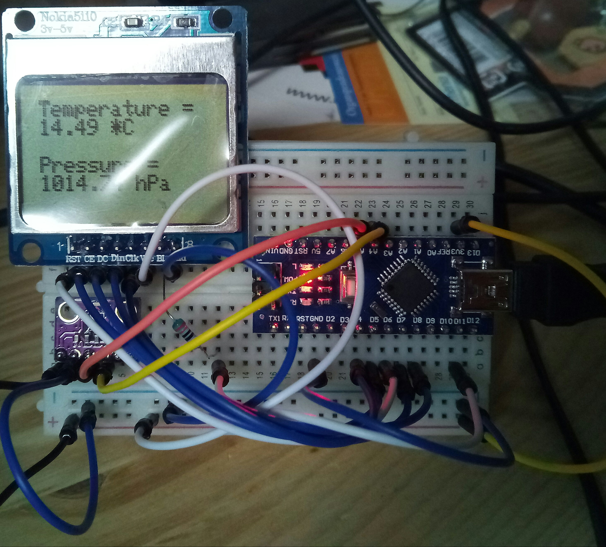

# Therm_Bar

An Arduino Nano, an old mobile phone display and a GY-BM E/P 280 sensor will give you a geeky thermometer/barometer.

Here is a photo:

### Parts

* 1 x Arduino Nano (or as in my case a Chinese clone)
* 1 x 200 Ohm resistor
* 1 x breadboard
* 1 x GY-BM E/P 280 sensor
* 1 x Nokia 5110 display
* a lot of cables

### Important hint

To make this work you have to make a change in the **_Adafruit BMP 280 Library_**: Change the I2C address in **Adafruit_BMP280.h** to **0x76**. If you forget this, the library won't be able to find the sensor.